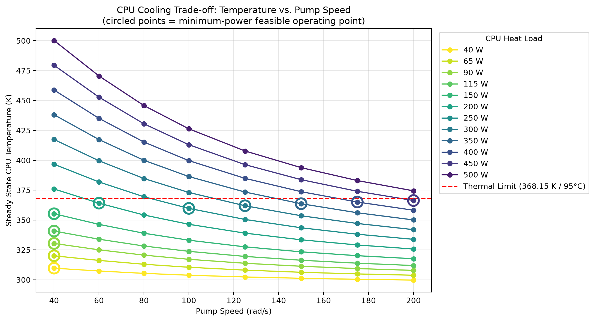

# 🖥️ Cooling a Server CPU — Finding the Sweet Spot Between Power and Temperature

*A physics-based simulation, automated with Python, that answers a simple question: how hard does a cooling pump actually need to work?*

<p align="center">
  
</p>

---

## Overview

**Problem:**
Liquid-cooled server racks face a direct trade-off: a faster pump improves cooling but consumes power that grows close to cubically with speed, while a slower pump saves energy but risks the CPU exceeding safe operating temperatures. Neither "run it slow to save power" nor "run it fast to be safe" is a defensible engineering answer without knowing exactly where the trade-off actually sits.

**Approach:**
Built a coupled fluid-thermal model in MATLAB Simscape (pump → coolant loop → cold plate → CPU thermal mass), validated every governing relationship against hand calculations, then used Python (`matlab.engine`) to automate a full parameter sweep across pump speeds and CPU heat loads. A Python analysis then scans the results to find, for each heat load, the lowest-power pump speed that still keeps the CPU under a defined thermal safety limit.

**Result:**
Across the tested heat load range, pump power required to stay thermally safe scales dramatically — from under 2W at light loads up to several hundred watts as heat load approaches the design's cooling limit. The model correctly identifies both the power-limited regime (where the pump's own minimum speed is already sufficient) and the thermally-limited regime (where speed must actively increase to hold temperature under the safety line).

---

## Tools & Environment

| Tool | Version | Purpose |
|---|---|---|
| MATLAB | R2024a | Simulation environment |
| Simscape (Thermal Liquid + Thermal domains) | R2024a | Physics-based pump, coolant, and heat transfer modeling |
| Python | 3.11 | Automation, optimization, plotting |
| `matlab.engine` | 24.1 | Python ↔ MATLAB bridge (only needed to re-run the sweep) |
| pandas / numpy | latest | Data handling |
| matplotlib | latest | Result visualization |
| pytest | latest | Tests for the analysis code |

---

## System Architecture

```
Reservoir (inlet) → Centrifugal Pump → Pipe → Coolant Chamber ⇄ Convective Heat Transfer ⇄ CPU Thermal Mass ← Heat Flow Source
                                                                                                                        ↓
                                                                                          Pipe → Reservoir (outlet)
```

The model couples two Simscape physical domains:
- **Thermal Liquid domain** — pump, piping, and coolant chamber, governing flow rate and pressure
- **Thermal domain** — CPU heat generation and thermal mass

A `Convective Heat Transfer` block bridges the two domains, computing `Q = h·A·(T_cpu − T_coolant)`, with `h` calculated dynamically from coolant flow rate via a MATLAB Function block — rather than held constant — since a fixed `h` was found during validation to eliminate the entire trade-off (see Limitations).

---

## Methodology

### 1. Modeling assumptions

- CPU and cold-plate modeled as a single lumped thermal mass (0.08 kg, cp = 900 J/kg·K) — valid for a small, conductive component with negligible internal temperature gradient
- Convective heat transfer coefficient modeled as flow-dependent: `h = C·ṁ^0.8`, based on the flow-exponent form of the Dittus–Boelter turbulent convection correlation, with `C` calibrated against a literature-realistic `h` at a representative flow rate
- Centrifugal pump parameterized from a manufacturer-style performance curve (nominal capacity 45 lpm @ 40m head, reference speed 1770 rpm)
- Coolant is water; inlet/outlet reservoirs modeled as fixed-pressure boundaries rather than a fully closed recirculating loop
- CPU heat load held constant per simulation run (40–500 W range tested), representing a steady operating condition rather than a dynamic workload

### 2. Validation

Every governing relationship was checked against hand calculations before being trusted in automation:

| Check | Method | Result |
|---|---|---|
| Transient thermal response | Step heat input, compared to theoretical exponential charging curve (`τ = m·cp / hA`) | Matched within simulation resolution |
| Steady-state energy balance | `T_cpu = T_coolant + Q/(hA)` at three heat loads | Within ~1% |
| Pump flow law | `V̇ = D·N` (fixed-displacement pump, prior to centrifugal pump calibration) | Within 0.2% |
| Pump power scaling | Compared simulated power growth across doubling speed intervals | Consistent with cubic centrifugal pump affinity law |

### 3. Test scenarios

- **Full factorial sweep:** 12 CPU heat loads (40–500 W) × 8 pump speeds (40–200 rad/s, restricted to the pump's confirmed valid operating region — see Limitations) = 96 simulations, run automatically via Python
- **Optimization:** for each heat load, minimum pump power subject to CPU temperature remaining under 368.15 K (95°C)

### 4. Post-processing

Pump hydraulic power is `P = Δp · V̇`, from the pressure rise across the pump and the volumetric flow (`ṁ / ρ`). It depends only on pump speed, not on heat load, because the fluid side is independent of the thermal side in this model. `analysis.pump_power_curve` checks that assumption on the data instead of assuming it.

---

## Results

**Key plot:**
Temperature vs. pump speed for every tested heat load, with the thermal safety limit overlaid and each heat load's optimal (minimum-power, thermally-safe) point circled (top of this page).

**Quantified comparison:**

| Heat Load (W) | Optimal Speed (rad/s) | CPU Temp (K) | Pump Power (W) |
|---|---|---|---|
| 40  | 40  | 309.7 | 1.62 |
| 150 | 40  | 355.3 | 1.62 |
| 200 | 60  | 364.1 | 9.09 |
| 350 | 150 | 363.7 | 155.4 |
| 450 | 200 | 366.3 | 368.4 |
| 500 | — | — | no speed in the tested range kept CPU temperature under the safety limit |

Pump power required to stay thermally safe rises **over 200×** between the power-limited regime (40–150 W) and the thermally-limited regime's upper end (450 W) — the central quantified finding of the project. Full table: `results/optimization_results.csv`.

**Honest limitations:**
- The convective coefficient correlation (`h = C·ṁ^0.8`) is a calibrated approximation, not derived from cold-plate channel geometry — real fidelity would require CFD or a manufacturer datasheet
- Below ~33 rad/s, the centrifugal pump produces zero or negative pressure rise (outside its valid operating curve); this region was identified via a pressure-rise sign check and excluded from all sweeps and optimization
- At 500 W, no speed up to 200 rad/s kept the CPU safe — this may indicate a genuine design limit, or simply that higher untested speeds would succeed; it has not been resolved either way
- CPU heat load is constant per run; a real server workload varies over time, which this steady-state model does not capture
- The coolant loop uses two independent pressure reservoirs rather than a closed recirculating loop

---

## Repository Structure

```
├── models/
│   └── server_cooling_loop_v2_working.slx      # Simscape model
├── src/cooling_optimizer/
│   ├── config.py        # paths, sweep grid, thermal limit, model block names
│   ├── simulation.py    # runs the sweep through the MATLAB Engine (only module that needs MATLAB)
│   ├── analysis.py      # pump power, minimum-power feasible speed per heat load
│   └── plotting.py      # trade-off and pump-power figures
├── scripts/
│   ├── run_sweep.py               # 1. simulate the full grid  -> results/sweep_results.csv
│   ├── optimize.py                # 2. find optimal points      -> results/optimization_results.csv
│   ├── plot_results.py            # 3. make the figures         -> results/*.png
│   └── check_matlab_connection.py # smoke test for the MATLAB Engine setup
├── tests/test_analysis.py         # unit tests + checks against the committed sweep
├── results/
└── README.md
```

---

## How to Run

```bash
# 1. Create and activate a Python 3.11 virtual environment
#    (required for MATLAB R2024a's matlab.engine compatibility)

# 2. Install the package and its dependencies
pip install -e ".[test]"

# 3. Run the tests (no MATLAB needed)
pytest

# 4. Re-run the analysis on the committed sweep (no MATLAB needed)
python scripts/optimize.py
python scripts/plot_results.py

# 5. Only to regenerate the sweep itself: install the MATLAB Engine API for Python
#    (run from <MATLAB_ROOT>/extern/engines/python), then
python scripts/check_matlab_connection.py
python scripts/run_sweep.py
```
├── models/
│   └── server_cooling_loop_v2_working.slx
├── scripts/
│   ├── sweep_pump_speed.py
│   ├── optimize.py
│   ├── compute_optimal_power.py
│   └── plot_final_tradeoff.py
├── results/
│   ├── full_sweep_final.csv
│   ├── optimization_results.csv
│   ├── optimal_power.csv
│   └── final_tradeoff_plot.png
└── README.md
```

---

## How to Run

```bash
# 1. Create and activate a Python 3.11 virtual environment
#    (required for MATLAB R2024a's matlab.engine compatibility)

# 2. Install dependencies
pip install numpy pandas matplotlib

---

## Code Cleanup (September 2026)

The Simscape model, the sweep design, the analysis logic and the results are my own work. In September 2026 I restructured the Python code from standalone scripts into a small package (shared config and analysis module, command-line scripts, tests) using Claude Code, Anthropic's coding assistant. The restructured analysis was checked against the original outputs: it selects the same optimal pump speed and CPU temperature for every heat load, and pump power matches to the rounding of the original CSVs. The simulation module was ported from the original `sweep_run.py` and has not been re-run since the restructuring. The original scripts remain in the `main` branch history.

---

## What I'd Do With More Time

- Replace the calibrated `h = C·ṁ^0.8` correlation with a CFD-derived or manufacturer-sourced correlation specific to the actual cold-plate channel geometry
- Extend the pump speed sweep above 200 rad/s to resolve whether 500 W is a genuine design limit
- Model a closed recirculating loop instead of independent pressure reservoirs
- Replace constant heat load with a time-varying server workload profile (idle → burst → idle)
- Cross-validate the centrifugal pump's performance curve against a real manufacturer datasheet rather than representative values

---

## References

- Dittus, F.W. and Boelter, L.M.K. — turbulent forced convection correlation (basis for the flow-dependent `h` model)
- MathWorks Simscape Fluids documentation — Thermal Liquid domain component library
- Manufacturer-style centrifugal pump performance curve parameters (nominal capacity/head, reference speed) used for pump calibration
